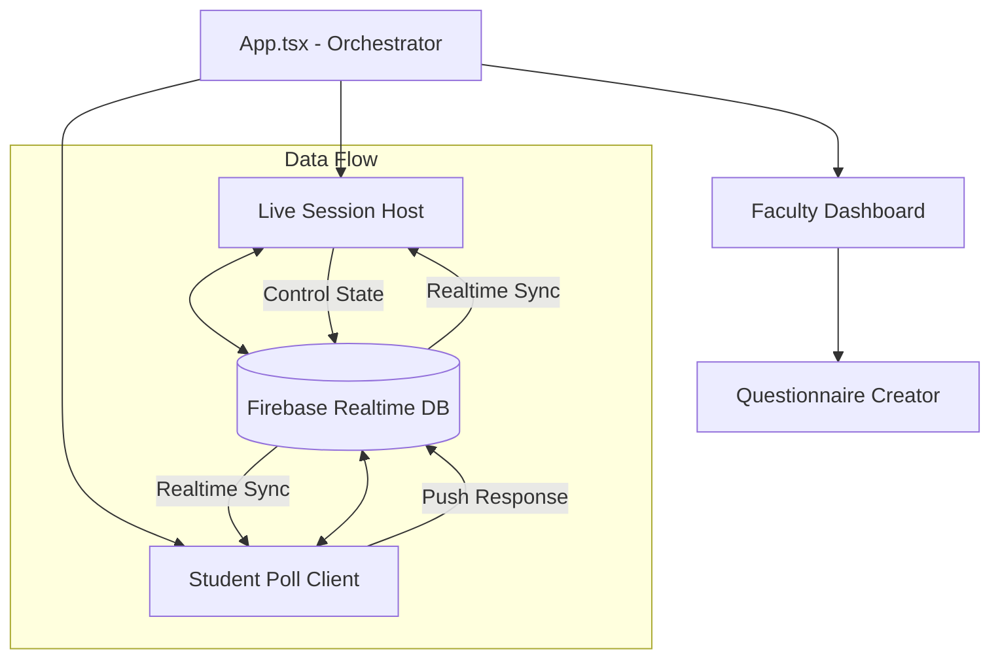

# System Architecture & Technical Design

## 1. High-Level Overview
UAQS follows a **Reactive Synchronized State** pattern. The application treats the Firebase Realtime Database as the shared global state, and all connected clients (Host and Participants) maintain a local copy of this state.

### Technology Stack
| Layer | Technology | Rationale |
| :--- | :--- | :--- |
| **Frontend** | React 19 + TypeScript | Type-safe development with concurrent rendering. |
| **Build Tool** | Vite | Ultra-fast HMR and optimized production bundles. |
| **Database** | Firebase RTDB | Real-time synchronization with minimal latency. |
| **Styling** | Vanilla CSS + Tailwind | Flexible, tokenized design system. |
| **Utilities** | html2canvas, jsPDF | Client-side report generation and data portability. |

---

## 2. Component Flow Diagram
The orchestrator (`App.tsx`) manages view transitions and Firebase observers.

---

## 3. Core Modules
### 3.1 Faculty Subsystem
- **Dashboard**: Consumes `LocalStorage` for local drafts and manages session creation.
- **Creator**: A modular form builder supporting Multiple Choice, Ranking, and Open-ended questions.
- **Reporting**: A service that captures the DOM state via `html2canvas` and generates multi-page PDFs using `jsPDF`.

### 3.2 Student Subsystem
- **Poll Client**: A context-aware UI that adjusts its display based on the `currentQuestionIndex` and `status` held in Firebase.
- **Fingerprinting**: Local-only validation to prevent duplicate entries without requiring login.

---
*Refer to `docs/DATABASE.md` for specific JSON payload schemas.*
