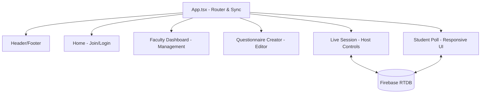

# System Documentation: Architecture & Design

## 1. Architectural Overview
The application follows a **Replicate-to-Client** pattern. The source of truth resides in Firebase, and all connected clients maintain a local reactive state that mirrors a specific branch of the database.

### High-Level Component Diagram

## 2. Design Decisions
- **React 19**: Chosen for improved performance and concurrent rendering capabilities.
- **Tailwind CSS**: Used for rapid UI development with strict institutional branding tokens.
- **Vite**: Utilized as the build engine to ensure fast Hot Module Replacement (HMR) during live session development.
- **Time Compensation Logic**: Instead of using server-side timers, the app uses shifted Unix timestamps. This minimizes the impact of network latency and allows for seamless Pause/Resume across different time zones.
- **Student Identity Gate**: Implemented a conditional UI "gate" that enforces participant identification before session entry, ensuring data accountability while maintaining a serverless architecture.

## 3. Data Models

### Assessment (Template)
| Property | Type | Description |
| :--- | :--- | :--- |
| id | string | Unique identifier for the questionnaire |
| title | string | Official name of the assessment |
| questions | Question[] | Array of question objects |
| isDraft | boolean | Visibility status in dashboard |
| requireStudentName | boolean | Flag to mandate student identification |

### Session (Live Instance)
| Property | Type | Description |
| :--- | :--- | :--- |
| accessCode | string | 4-digit code generated for entry |
| status | enum | Current phase: waiting, active, paused, ended |
| startTime | number | Timestamp used to calculate countdowns |
| allResponses | object | Map of question indices to response aggregates |
| requireStudentName | boolean | Enforced state for the active live session |

## 4. Logical Flow
1. **Creation**: Instructor defines an `Assessment`.
2. **Activation**: Instructor launches a `Session` based on an `Assessment`.
3. **Synchronization**: Students subscribe to the `Session` via Access Code.
4. **Interactive Loop**:
   - Host updates `currentQuestionIndex`.
   - Timer starts on all clients based on `startTime`.
   - Students submit to `allResponses`.
   - Host ends when total `participantsCount` is reached or time expires.

---
*Refer to `docs/API_DOCUMENTATION.md` for specific JSON payload schemas.*
