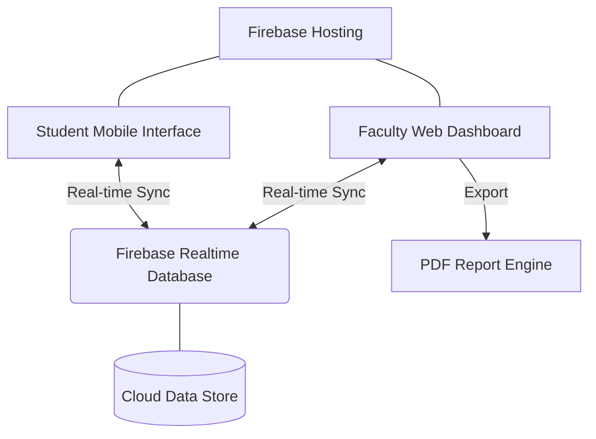

# Project Documentation: UMak Academic Questionnaire System (UAQS)

## 1. Project Overview
*   **System Name:** University Academic Questionnaire System (UAQS)
*   **Purpose:** To modernize classroom engagement and academic data collection by providing a real-time, interactive platform for assessments and surveys.
*   **Target Users:** Faculty members (as session controllers) and Students (as participants).
*   **Short Description:** UAQS is a "Web + Mobile" responsive platform that allows instructors to create rich academic questionnaires and conduct live, synchronized sessions where students can participate instantly via their mobile devices.

---

## 2. System Features
*   **Intuitive Form Builder:** Create questionnaires with support for Multiple Choice, True/False, Rating Scales, and Short Answers.
*   **Real-time Synchronization:** Instant updates across all devices as the instructor navigates through the session.
*   **Zero-Friction Access:** Students join sessions via a simple 4-digit academic access code (no registration required).
*   **Live Analytics Dashboard:** Visual feedback for faculty through dynamic charts and participation counters.
*   **Academic Reporting:** Export summarized results into professional, University-branded PDF reports.
*   **Draft Resilience:** Automatic saving of work-in-progress assessments to prevent data loss.

---

## 3. System Architecture
The system follows a modern serverless architecture optimized for real-time performance.

---

## 4. Tech Stack
*   **Frontend:** React 18, TypeScript, Tailwind CSS (Styling), Vite (Build Tool).
*   **Backend:** Firebase Realtime Database (Sync), Firebase App Check (Security).
*   **Database:** Firebase Realtime Database (NoSQL).
*   **Tools:** VS Code, Figma (UI/UX), Git (Version Control).
*   **Hosting Tool:** Firebase Hosting.

---

## 5. User Flow / Process Flow
1.  **Preparation:** Faculty builds a "Bundle" (the questionnaire) using the Creator Tool.
2.  **Activation:** Faculty clicks "Start Session" which generates a unique 4-digit Access Code.
3.  **Onboarding:** Students visit the site on their phones and enter the code to join the live room.
4.  **Live Flow:** Faculty controls when to move to the next question; the student's screen updates instantly.
5.  **Submission:** Students submit their responses, which are stored and aggregated in the cloud.
6.  **Reporting:** Once the session ends, the Faculty generates a PDF report summarizing all student performance and survey data.

---

## 6. Screens / UI Overview
*   **Home Portal:** A welcoming dual-entry screen for Faculty and Students.
*   **Questionnaire Creator:** A focused environment for designing question sets with custom logic.
*   **Faculty Dashboard:** A hub for managing saved bundles and viewing draft progress.
*   **Live Control Panel (Instructor):** The "Control Tower" showing current question stats and navigation buttons.
*   **Student Response Screen:** A minimalist, mobile-friendly interface designed for rapid response entry.

---

## 7. Database / Data Structure
The database is structured as a JSON tree in Firebase RTDB:
*   **`bundles/`**: Contains the master templates for questionnaires (e.g., `bundleId`, `title`, `questions[]`).
*   **`sessions/`**: Holds the state of active sessions (e.g., `activeCode`, `currentQuestionIndex`, `status`).
*   **`responses/`**: Stores player submissions (e.g., `sessionId`, `studentName`, `answers[]`).

---

## 8. Key Functionalities Explanation
### Real-time Synchronization
*   **What it does:** Ensures every student sees the same question as the instructor at the exact same time.
*   **How it works:** The instructor's app updates a "current index" field in the database. Students have a "listener" active that detects this change and instantly flips their screen.

### Automated Academic Reporting
*   **What it does:** Generates a one-click PDF summary of the entire session.
*   **How it works:** The system aggregates response data into charts using Recharts, then uses `jsPDF` to render a formal document with the University's header and tabulated results.

---

## 9. Challenges & Solutions
*   **Problem:** Data loss when the browser is refreshed or closed during questionnaire creation.
    *   **Solution:** Implemented a **Local Vault** system using Browser LocalStorage that auto-saves drafts every few seconds.
*   **Problem:** High traffic during student "Join" spikes causing lag.
    *   **Solution:** Optimized Firebase security rules and utilized indexed paths for session lookups to ensure millisecond response times.

---

## 10. Future Improvements
*   **UMak SSO:** Integration with the university's official Single Sign-On for verified student identities.
*   **Cloud Sync:** Moving LocalStorage drafts to a cloud-authenticated database for cross-device editing.
*   **Peer Evaluation Mode:** Adding features for students to assess each other's work within the app.

---

## 11. Conclusion
UAQS is a vital tool for the UMak community, bridging the gap between traditional lecture methods and modern digital interaction. By providing a reliable, beautiful, and real-time experience, it empowers instructors to make data-driven decisions and engages students in a way that reflects the university's commitment to academic excellence.
